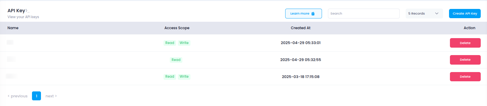

# **Access API Token**

This guide explains how to access and manage your **API Token** in Utho Cloud, enabling programmatic access to the platform through the API.

---

## **Step 1: Login or Sign Up**

1. Navigate to the [Login Page](https://console.utho.com/login).
2. Enter your credentials and click **Login**.
3. If you don’t have an account yet, [Sign Up](https://console.utho.com/signup) here.
4. After successful login, you will be redirected to your **Utho Cloud Dashboard**.

---

## **Step 2: Access API Token**

After logging in, there are several ways to access your **API Token** page:

### **Method 1: Using the Sidebar Navigation**

1. From the **Dashboard**, look at the **sidebar** on the left.
2. Scroll to locate the **Account** section.
3. Under **Account**, click on **API Token**.
4. You’ll be redirected to the **API Token** page where you can view and manage your tokens.

---

### **Method 2: Using the Sidebar Search Bar**

1. In the sidebar, locate the **search bar** at the top.
2. Type **"API Token"**.
3. The sidebar will filter and display the **API Token** option.
4. Click on it to open the **API Token** page.

---

### **Method 3: Direct Link Access**

You can also directly access the **API Token** page after logging in by clicking the link below:

👉 [Go to API Token](https://console.utho.com/api)

---

## **What You’ll See**

On the **API Token** page, you will find a list of all the API tokens you have created. Each entry typically includes the following details:

- **API Name**: The name of the API token, used to identify its purpose or usage.
- **Access Scope**: Whether the token has **Read-Only** or **Write** permissions.
- **Created At**: The timestamp of when the API token was created.
- **Action**: Options to delete or manage the token as needed.

You can also create new tokens and configure their access scope from this page.

Below is a visual example of the **API Token** page layout so you know what to expect:

