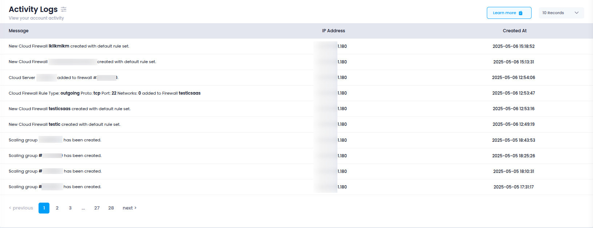

# **Access Activity Logs**

This guide explains how to access the **Activity Logs** section in Utho Cloud, where users and administrators can view a detailed record of actions performed within the platform.

---

## **Step 1: Login or Sign Up**

1. Navigate to the [Login Page](https://console.utho.com/login).
2. Enter your credentials and click **Login**.
3. If you don’t have an account yet, [sign up here](https://console.utho.com/signup).
4. After successful login, you will be redirected to your **Utho Cloud Dashboard**.

---

## **Step 2: Access Activity Logs**

After logging in, there are multiple ways to access the **Activity Logs** section:

### **Method 1: Using the Sidebar Navigation**

1. From the **Dashboard**, look at the **sidebar** on the left.
2. Scroll to locate the **Account** section.
3. Under **Account**, click on **Activity Logs**.
4. You’ll be redirected to the **Activity Logs** page where all recent actions are listed.

---

### **Method 2: Using the Sidebar Search Bar**

1. In the sidebar, locate the **search bar** at the top.
2. Type **"Activity Logs"**.
3. The sidebar will filter and display the **Activity Logs** option.
4. Click on it to open the **Activity Logs** page.

---

### **Method 3: Direct Link Access**

If you prefer, you can directly access the **Activity Logs** page after logging in by clicking the link below:

👉 [Go to Activity Logs](https://console.utho.com/activity)

---

## **What You’ll See**

On the **Activity Logs** page, you will find a detailed timeline of user and system actions. Each log entry typically includes the following information:

- **Message**: A description of the action performed by the user (e.g., "Deleted Cloud instance", "Logged in", etc).
- **IP Address**: The IP address from which the action originated.
- **Created At**: The date and time when the action was recorded.

These logs are essential for tracking changes, analyzing behavior, diagnosing issues, and fulfilling audit or compliance requirements.

Below is a visual example of the **Activity Logs** page layout so you know what to expect:

