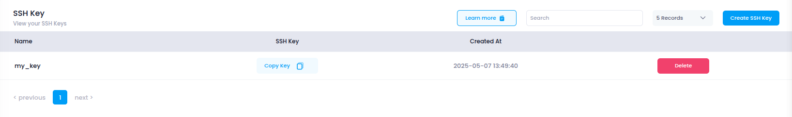

# **Access SSH Keys**

This guide explains how to access and manage SSH keys in **Utho Cloud**, which are used to securely authenticate and connect to cloud instances without the need for passwords.

---

## **Step 1: Login or Sign Up**

1. Navigate to the [Login Page](https://console.utho.com/login).
2. Enter your credentials and click **Login**.
3. If you don’t have an account yet, [Sign Up](https://console.utho.com/signup) here.
4. After successful login, you will be redirected to your **Utho Cloud Dashboard**.

---

## **Step 2: Access SSH Keys**

After logging in, there are multiple ways to access the **SSH Keys** section:

### **Method 1: Using the Sidebar Navigation**

1. From the **Dashboard**, locate the **sidebar** on the left.
2. Scroll to find the **Account** section.
3. Under **Account**, click on **SSH Keys**.
4. You’ll be redirected to the **SSH Keys** page where all your created SSH keys are listed.

---

### **Method 2: Using the Sidebar Search Bar**

1. In the sidebar, locate the **search bar** at the top.
2. Type **"SSH Keys"**.
3. The sidebar will filter and display the **SSH Keys** option.
4. Click on it to open the **SSH Keys** page.

---

### **Method 3: Direct Link Access**

If you prefer, you can directly access the **SSH Keys** page after logging in by clicking the link below:

👉 [Go to SSH Keys](https://console.utho.com/ssh)

---

## **What You’ll See**

On the **SSH Keys** page, you will find the following information for each SSH key:

- **Name**: The name you assigned to the SSH key during creation.
- **SSH Key**: A button to **Copy** the SSH key content.
- **Created At**: The date and time the SSH key was created.
- **Action**: The option to **Delete** the SSH key if no longer needed.
  

These SSH keys are crucial for securely accessing your cloud instances without the need for a password-based login.
