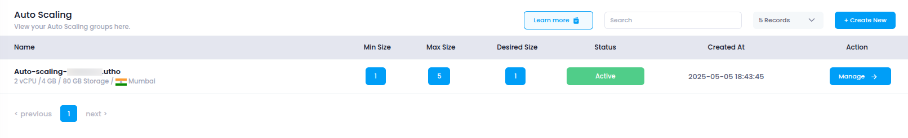

# **Access Auto Scaling**

This guide explains how to access the **Auto Scaling** section in **Utho Cloud**, where you can deploy and manage scalable compute instances that automatically adjust based on traffic load and performance metrics.

---

## **Step 1: Login or Sign Up**

1. Navigate to the [Login Page](https://console.utho.com/login).
2. Enter your credentials and click **Login**.
3. If you don’t have an account yet, [Sign Up](https://console.utho.com/signup) here.
4. After successful login, you will be redirected to your **Utho Cloud Dashboard**.

---

## **Step 2: Access Auto Scaling**

Once logged in, there are multiple ways to access the **Auto Scaling** section:

### **Method 1: Using the Sidebar Navigation**

1. On the **Dashboard**, locate the **sidebar** on the left-hand side.
2. Scroll to the **Compute** section.
3. Click on **Auto Scaling**.
4. You’ll be redirected to the **Auto Scaling Listing Page**, where all deployed Auto Scaling groups are displayed.

---

### **Method 2: Using the Sidebar Search Bar**

1. Locate the **search bar** at the top of the sidebar.
2. Type **"Auto Scaling"**.
3. The filtered result will display **Auto Scaling**.
4. Click on it to open the **Auto Scaling Listing Page**.

---

### **Method 3: Direct Link Access**

If you prefer, you can directly access the **Auto Scaling** listing page after logging in via this link:

👉 [Go to Auto Scaling](https://console.utho.com/auto-scaling)

---

## **What You’ll See**

On the **Auto Scaling Listing Page**, you will find:

- **Name**: The name you assigned during deployment.
- **Status**: Indicates if the group is **Active**, **Pending**, or **Error**.
- **Created At**: Timestamp of when the instance group was created.
- **Scaling Configuration**: Key details such as Min/Max/Desired instance count.
- **Actions**: Options to **Manage**, **Update**, or **Destroy** the Auto Scaling group.

Here is a preview of what the interface looks like:

By accessing this section, you can manage high availability, traffic handling, and scalability features essential for dynamic cloud applications.
