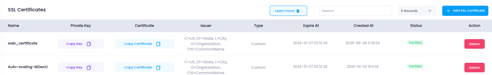

# **Access SSL Certificates**

This guide will walk you through how to access, view, and manage your **SSL certificates** in the **Utho Cloud Platform** to ensure secure communications for your websites and applications.

---

## **Step 1: Login or Sign Up**

1. Navigate to the [Login Page](https://console.utho.com/login).
2. Enter your credentials and click **Login**.
3. If you don’t have an account yet, [Sign Up](https://console.utho.com/signup).
4. After successful login, you will be redirected to your **Utho Cloud Dashboard**.

---

## **Step 2: Access the SSL Certificate Page**

After logging in, use one of the following methods to access your SSL certificates:

### **Method 1: Using the Sidebar Navigation**

1. From the **Dashboard**, locate the **sidebar** on the left.
2. Scroll to the **Security** section.
3. Click on **SSL Certificate**.
4. You will be redirected to the **SSL Certificate Listing Page**, where you can view all of your existing SSL certificates.

---

### **Method 2: Using the Sidebar Search Bar**

1. Locate the **search bar** at the top of the sidebar.
2. Type **"SSL Certificate"**.
3. The sidebar will filter the results and display **SSL Certificate** under the **Compute** category.
4. Click on **SSL Certificate** to open the listing page.

---

### **Method 3: Direct Link Access**

You can directly access the SSL Certificate page by clicking the link below (you must be logged in):

👉 [Go to SSL Certificate](https://console.utho.com/ssl)

---

## **What You’ll See**

On the **SSL Certificate Listing Page**, you’ll find:

- **Certificate Name**: The name assigned to each SSL certificate.
- **Issuer**: The organization that issued the certificate.
- **Expire Date**: The date and time when the certificate will expire.
- **Actions**: Options to view, update, or delete the certificate.

By following these steps, you will be able to easily access and manage your SSL certificates within Utho Cloud for secure communication.

