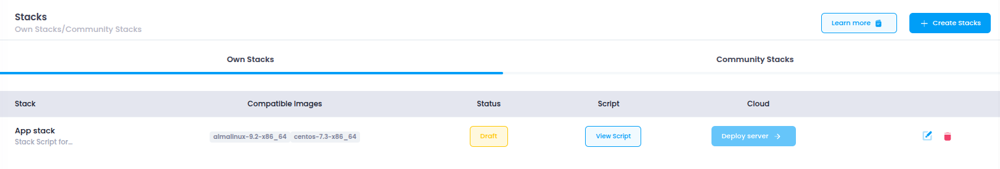

# **Access Stacks**

This guide explains how to access and manage your **Stacks** within **Utho Cloud**, enabling you to deploy, modify, and maintain your application environments and workloads.

---

## **Step 1: Login or Sign Up**

1. Navigate to the [Login Page](https://console.utho.com/login).
2. Enter your credentials and click **Login**.
3. If you don’t have an account yet, [Sign Up](https://console.utho.com/signup).
4. After successful login, you will be redirected to your **Utho Cloud Dashboard**.

---

## **Step 2: Access Stacks**

After logging in, use one of the following methods to access your cloud stacks:

### **Method 1: Using the Sidebar Navigation**

1. From the **Dashboard**, locate the **sidebar** on the left.
2. Scroll to the **Compute** section.
3. Click on **Stacks**.
4. You will be redirected to the **Stacks Listing Page**, where all your deployed stacks are displayed.

---

### **Method 2: Using the Sidebar Search Bar**

1. Locate the **search bar** at the top of the sidebar.
2. Type **"Stacks"**.
3. The sidebar will filter the results and display **Stacks** under the **Compute** category.
4. Click on **Stacks** to open the listing page.

---

### **Method 3: Direct Link Access**

You can directly access the **Stacks** page by clicking the link below (you must be logged in):

👉 [Go to Stacks](https://console.utho.com/stacks)

---

## **What You’ll See on the Stacks Listing Page**

On the **Stacks Listing Page**, you will find a comprehensive view of your deployed stacks, with key information such as:

- **Stack Name**: The name assigned to each stack during its creation.
- **OS Image**: The operating system or image selected for the stack.
- **Status**: The current state of the stack (e.g., Active, Draft, or Inactive).
- **Stack Script**: Any script associated with the stack will be visible here.
- **Actions**: Options to **Deploy Server**, **Edit**, and **Delete** stacks, as well as manage related resources.
  

