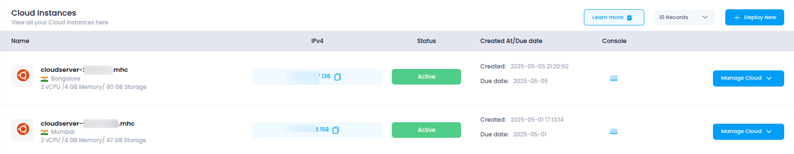

# **Access Cloud Instances**

This guide explains how to access and navigate the **Cloud Instances** section in **Utho Cloud**, where you can create and manage virtual machines (cloud instances) to run your applications and workloads.

---

## **Step 1: Login or Sign Up**

1. Navigate to the [Login Page](https://console.utho.com/login).
2. Enter your credentials and click **Login**.
3. If you don’t have an account yet, [Sign Up](https://console.utho.com/signup).
4. After successful login, you will be redirected to your **Utho Cloud Dashboard**.

---

## **Step 2: Access Cloud Instances**

After logging in, use one of the following methods to access your cloud instances:

### **Method 1: Using the Sidebar Navigation**

1. From the **Dashboard**, locate the **sidebar** on the left.
2. Scroll to the **Compute** section.
3. Click on **Cloud**.
4. You will be redirected to the **Cloud Instances Listing Page**, where all your deployed instances are displayed.

---

### **Method 2: Using the Sidebar Search Bar**

1. Locate the **search bar** at the top of the sidebar.
2. Type **"Cloud Instances"**.
3. The sidebar will filter the results and display **Cloud Instances** under the **Compute** category.
4. Click on **Cloud Instances** to open the listing page.

---

### **Method 3: Direct Link Access**

You can directly access the Cloud Instances page by clicking the link below (you must be logged in):

👉 [Go to Cloud Instances](https://console.utho.com/cloud)

---

## **What You’ll See**

On the **Cloud Instances Listing Page**, you’ll find:

- **Instance Name**: The name assigned to each virtual machine.
- **Region**: The data center location where the instance is hosted.
- **Status**: Current state of the instance (e.g., Active, Inavtive).
- **Creation Date**: The date and time of instance deployment.
- **Actions**: Options to manage, stop, restart, or destroy the instance.

This interface allows you to quickly view and manage all of your deployed cloud infrastructure.

---

By following this guide, you can easily access and begin managing your cloud instances within Utho Cloud.

