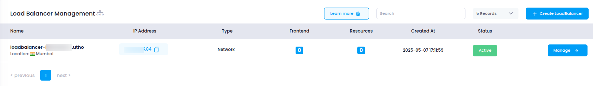

# **Access Load Balancer in Utho Cloud**

This guide walks you through accessing the **Load Balancer** section in Utho Cloud, where you can create, manage, and configure load balancers to ensure optimal traffic distribution across your backend servers.

---

## **Step 1: Login to Utho Cloud**

1. Visit the [Utho Cloud Console](https://console.utho.com/login).
2. Enter your account credentials and click **Login**.
3. After successful login, you’ll be redirected to the **Utho Cloud Dashboard**.

---

## **Step 2: Navigate to the Load Balancer Section**

You can access the **Load Balancer** dashboard using one of the following methods:

### **Method 1: Using the Sidebar Menu**

1. In the dashboard, locate the **left sidebar menu**.
2. Scroll down to the **Networking** section.
3. Click on **Load Balancer**.
4. You will be redirected to the **Load Balancer Listing Page**, where all your existing load balancers are listed.

---

### **Method 2: Using the Sidebar Search**

1. Locate the **search bar** at the top of the sidebar.
2. Type **"Load Balancer"** in the search field.
3. Select **Load Balancer** from the filtered results.
4. You’ll be redirected to the **Load Balancer Listing Page**.

---

### **Method 3: Direct URL Access**

You can directly access the load balancer section using the link below (you must be logged in):

👉 [Go to Load Balancer Page](https://console.utho.com/loadbalancer)

---

## **What You’ll See**

On the **Load Balancer Listing Page**, you will find the following information for each load balancer:

- **Name**: The name assigned to the load balancer during creation.
- **Status**: The current operational status (e.g., active, inactive).
- **Attached Servers**: The number of backend servers currently associated with the load balancer.
- **Created At**: The date and time the load balancer was created.
- **Action**: Options to **Manage**, **Delete**, or **View Details** of the load balancer.
  

By following these steps, you can access and begin managing your load balancers in the Utho Cloud Platform to ensure the smooth operation of your network and applications.
