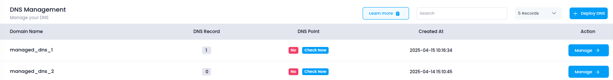

# **Access Managed DNS in Utho Cloud**

This guide walks you through accessing the **Managed DNS** section in Utho Cloud, where you can create, manage, and configure DNS records for your domains to ensure proper domain name resolution and reliability.

---

## **Step 1: Login to Utho Cloud**

1. Visit the [Utho Cloud Console](https://console.utho.com/login).
2. Enter your account credentials and click **Login**.
3. After successful login, you’ll be redirected to the **Utho Cloud Dashboard**.

---

## **Step 2: Navigate to the Managed DNS Section**

You can access the **Managed DNS** dashboard using one of the following methods:

### **Method 1: Using the Sidebar Menu**

1. In the dashboard, locate the **left sidebar menu**.
2. Scroll down to the **Networking** section.
3. Click on **Managed DNS**.
4. You will be redirected to the **Managed DNS Listing Page**, where all your existing domains are listed.

---

### **Method 2: Using the Sidebar Search**

1. Locate the **search bar** at the top of the sidebar.
2. Type **"Managed DNS"** in the search field.
3. Select **Managed DNS** from the filtered results.
4. You’ll be redirected to the **Managed DNS Listing Page**.

---

### **Method 3: Direct URL Access**

You can directly access the Managed DNS section using the link below (you must be logged in):

👉 [Go to Managed DNS Page](https://console.utho.com/dns)

---

## **What You’ll See**

On the **Managed DNS Listing Page**, you will find the following information for each DNS zone:

- **Domain Name**: The domain for which DNS is managed.
- **Status**: The current state of the DNS configuration.
- **Record Count**: Total number of DNS records associated with the domain.
- **Created At**: The date and time the DNS was deployed.
- **Action**: Options to **Manage**, **Delete**, or **View Details** of the DNS configuration.

By following these steps, you can access and begin managing DNS settings in the Utho Cloud Platform to ensure proper routing and resolution for your web services.
