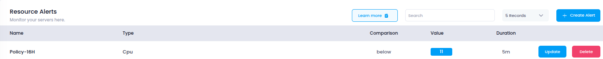
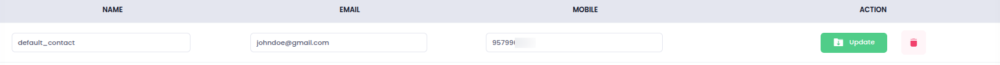

# **Access Monitoring in Utho Cloud**

This guide explains how to access the **Monitoring** section in Utho Cloud, where you can track cloud resource performance, set up alerts, and manage notification contacts for your infrastructure.

---

## **Step 1: Login to Utho Cloud**

1. Open the [Utho Cloud Console](https://console.utho.com/login).
2. Enter your credentials and click **Login**.
3. You’ll land on the **Utho Cloud Dashboard** after logging in successfully.

---

## **Step 2: Navigate to the Monitoring Section**

There are multiple ways to access the **Monitoring** dashboard:

### **Method 1: Using the Sidebar Menu**

1. On the left sidebar of the dashboard, scroll to find the **Monitoring** section.
2. Click on **Monitoring**.
3. You will be redirected to the **Monitoring Listing Page**, showing tabs for **Resource Alerts** and **Monitoring Contacts**.

---

### **Method 2: Using the Sidebar Search**

1. Use the **sidebar search bar** at the top.
2. Type **"Monitoring"** into the search field.
3. Click on the **Monitoring** result.
4. You’ll be taken to the **Monitoring Listing Page**.

---

### **Method 3: Direct URL Access**

You can go directly to the monitoring section using this link (ensure you’re logged in):

👉 [Go to Monitoring Page](https://console.utho.com/monitoring)

---

## **What You’ll See**

The **Monitoring Listing Page** is divided into two main tabs:

### **1. Resource Alerts**
Displays all active monitoring alerts with key information:
- **Name**: Identifier for the alert.
- **Type**: Metric being tracked (e.g., CPU, Memory, Disk).
- **Comparison**: Threshold condition (e.g., is above, is below).
- **Value**: Threshold value set for alerting.
- **Duration**: How long the condition must persist before alerting.
- **Actions**: Options to **Create**, **Update**, or **Delete** alerts.
  

### **2. Monitoring Contacts**
Lists all configured alert recipients:
- **Name**: Contact person’s name.
- **Email**: Email address for receiving alerts.
- **Mobile**: Mobile number for SMS alerts.
- **Actions**: Options to **Add**, **Edit**, or **Delete** a contact.

By accessing the Monitoring section, you can configure alerts and contacts to receive real-time notifications and ensure the performance of your cloud infrastructure is always under watch.
