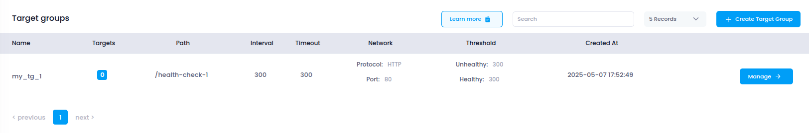

# **Access Target Groups in Utho Cloud**

This guide walks you through accessing the **Target Group** section in Utho Cloud, where you can create, configure, and manage target groups to route traffic effectively and maintain the health of backend services.

## **Step 1: Login or Sign Up to Utho Cloud**

1. Go to the [Utho Cloud Console](https://console.utho.com/login).
2. If you **already have an account**, enter your credentials and click **Login**.
3. If you **don’t have an account**, click on [Signup](https://console.utho.com/signup)
4. After logging in, you'll be redirected to the **Utho Cloud Dashboard**.

## **Step 2: Navigate to the Target Groups Section**

You can access the **Target Groups** section via the following methods:

### **Method 1: Sidebar Navigation**

1. In the dashboard, locate the **sidebar menu** on the left.
2. Scroll down to the **Networking** section.
3. Click on **Target Group**.
4. You’ll be redirected to the **Target Group Listing Page**.

### **Method 2: Using the Search Bar**

1. Use the **search bar** at the top of the sidebar.
2. Type **"Target Group"**.
3. Click on **Target Group** from the search results.

### **Method 3: Direct URL Access**

If you are already logged in, you can directly open the section:

👉 [Go to Target Groups](https://console.utho.com/targetgroup)

---

## **What You'll See in the Target Group Section**

Upon entering the **Target Group Listing Page**, you will encounter the following elements:

1. **Name**: The name of the target group.
2. **Targets**: The number of backend resources (servers, instances) associated with the target group.
3. **Path**: The health check path defined for the target group (e.g., `/health`).
4. **Interval**: The time interval between health checks.
5. **Timeout**: The timeout duration for health checks.
6. **Network**: The network or protocol being used for the target group (e.g., HTTP, HTTPS).
7. **Threshold**: The health check thresholds (both healthy and unhealthy) for the target group.
8. **Created At**: The timestamp when the target group was created.

Target Groups in Utho Cloud enable precise traffic management and health monitoring of backend resources. By properly configuring and managing them, you can ensure efficient routing, high availability, and better scalability of your services.
