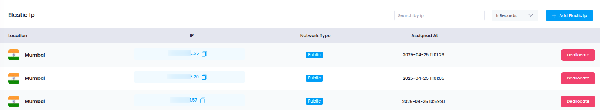

# **Access Elastic IPs in Utho Cloud**

This guide walks you through accessing, allocating, and managing **Elastic IPs** in Utho Cloud for your cloud resources, such as instances and NAT Gateways.

## **Step 1: Login or Sign Up to Utho Cloud**

1. Go to the [Utho Cloud Console](https://console.utho.com/login).
2. If you **already have an account**, enter your credentials and click **Login**.
3. If you **don’t have an account**, click on [Signup](https://console.utho.com/signup).
4. After logging in, you'll be redirected to the **Utho Cloud Dashboard**.

## **Step 2: Navigate to the Elastic IPs Section**

You can access the **Elastic IPs** section via the following methods:

### **Method 1: Sidebar Navigation**

1. In the dashboard, locate the **sidebar menu** on the left.
2. Scroll down to the **Networking** section.
3. Click on **VPC**.
4. From the VPC menu, select **Elastic IPs**.
5. You’ll be redirected to the **Elastic IP Listing Page**.

### **Method 2: Using the Search Bar**

1. Use the search bar at the top of the sidebar.
2. Type **"VPC"** in the search bar.
3. Click on the **VPC** option from the search results.
4. This will expand the VPC menu in the sidebar.
5. Within the expanded VPC menu, click on **Elastic IP**.
6. You will be redirected to the **Elastic IP Listing Page**.

### **Method 3: Direct URL Access**

If you are already logged in, you can directly open the section:

👉 [Go to Elastic IPs](https://console.utho.com/vpc/elasticip)

---

## **What You'll See in the Elastic IPs Section**

Upon entering the **Elastic IP Listing Page**, you will encounter the following elements:

1. **Elastic IP ID**: The unique identifier of each Elastic IP.
2. **IP Address**: The actual public IP address.
3. **Type**: The type of IP (Static or Dynamic).
4. **Location**: The data center location of the IP.
5. **Network Type**: The network type associated with the IP (e.g., Public).
6. **Threshold**: The usage status or associated resource (e.g., instance, NAT Gateway).
7. **Created At**: The timestamp when the Elastic IP was allocated.

---

Target Elastic IPs in Utho Cloud enable reliable public access to your cloud resources, and by properly managing these IPs, you ensure consistent connectivity and resource management in your infrastructure.
