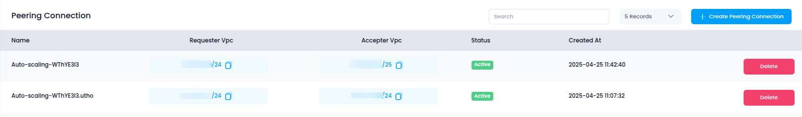

# **Access Peering Connections in Utho Cloud**

This guide walks you through accessing the **Peering Connections** section in Utho Cloud, where you can establish secure and private communication between Virtual Private Clouds (VPCs).

## **Step 1: Login or Sign Up to Utho Cloud**

1. Go to the [Utho Cloud Console](https://console.utho.com/login).
2. If you **already have an account**, enter your credentials and click **Login**.
3. If you **don’t have an account**, click on [Signup](https://console.utho.com/signup).
4. After logging in, you'll be redirected to the **Utho Cloud Dashboard**.

## **Step 2: Navigate to the Peering Connections Section**

You can access the **Peering Connections** section in the following ways:

### **Method 1: Sidebar Navigation**

1. On the left sidebar, scroll to the **Networking** or **VPC** section.
2. Click on **Peering Connections**.
3. You will be redirected to the **Peering Connections Listing Page**.

### **Method 2: Using the Search Bar**

1. Use the search bar at the top of the sidebar.
2. Type **"VPC"** in the search bar.
3. Click on the **VPC** option from the search results.
4. This will expand the VPC menu in the sidebar.
5. Within the expanded VPC menu, click on **Peering Connections**.
6. You will be redirected to the **Peering Connections Listing Page**.

### **Method 3: Direct URL Access**

If you're already logged in, access the section directly here:

👉 [Go to Peering Connections](https://console.utho.com/vpc/peeringconnection)

---

## **What You'll See in the Peering Connections Section**

Once inside the **Peering Connections Listing Page**, the following columns and information are displayed:

1. **Name**: The name of the peering connection.
2. **Requester VPC / Subnet**: The initiating VPC and subnet.
3. **Accepter VPC / Subnet**: The target VPC and subnet receiving the connection.
4. **Status**: Shows whether the connection is **Active**, **Pending**, or **Rejected**.
5. **Actions**: Options to **Manage** or **Delete** the peering connection.

Peering Connections allow you to create secure, low-latency, and scalable network architectures across VPCs. Accessing this section is your first step in setting up efficient cloud networking in Utho Cloud.
