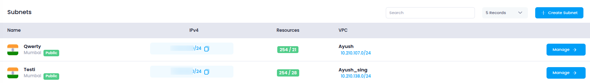

# **Access Subnets in Utho Cloud**

This guide walks you through accessing the **Subnets** section in Utho Cloud, where you can create, configure, and manage subnets within your Virtual Private Cloud (VPC).

---

## **Step 1: Login or Sign Up to Utho Cloud**

1. Visit the [Utho Cloud Console](https://console.utho.com/login).
2. If you already have an account, enter your credentials and click **Login**.
3. If you're new, click [Signup](https://console.utho.com/signup) and complete the registration process.
4. After logging in, you'll land on the **Utho Cloud Dashboard**.

---

## **Step 2: Navigate to the Subnets Section**

You can access the **Subnets** page using the following methods:

### **Method 1: Sidebar Navigation**

1. On the dashboard, locate the **sidebar menu** on the left.
2. Scroll down to the **Networking** section.
3. Click on **VPC** to expand the networking options.
4. Select **Subnets** from the expanded list.
5. You’ll be redirected to the **Subnets Listing Page**.

### **Method 2: Using the Search Bar**

1. Use the **search bar** at the top of the sidebar.
2. Type **"VPC"**.
3. Click on the **VPC** item from the search results.
4. The sidebar menu will expand showing options under VPC.
5. Click on **Subnets** to open the **Subnets Listing Page**.

### **Method 3: Direct URL Access**

If you're already logged in, you can directly access the Subnets section:

👉 [Go to Subnets](https://console.utho.com/vpc/subnets)

---

## **What You'll See in the Subnet Section**

Once inside the **Subnets Listing Page**, you'll find a list of all subnets created in your account, along with key information such as:

- **Name**: Name of the subnet.
- **Subnet ID**: Unique identifier for the subnet.
- **IPV4**: Subnet's assigned CIDR block.
- **Default**: Indicates whether it's the default subnet.
- **VPC ID**: ID of the parent VPC.
- **Manage**: Button to view and modify the subnet configuration.

Subnets in Utho Cloud provide logical network boundaries within your VPC to control traffic flow, attach services, and manage public/private routing. They’re essential for building secure, scalable cloud environments.

---
