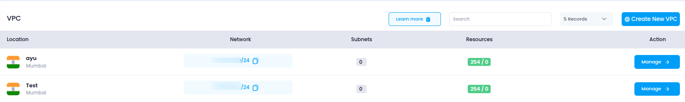

# **Access VPCs in Utho Cloud**

This guide will help you access and manage your **Virtual Private Clouds (VPCs)** in Utho Cloud to ensure efficient and secure cloud network management.

---

## **Step 1: Login or Sign Up to Utho Cloud**

1. Visit the [Utho Cloud Console](https://console.utho.com/login).
2. If you already have an account, enter your credentials and click **Login**.
3. If you're new, click [Signup](https://console.utho.com/signup) and complete the registration process.
4. After logging in, you'll land on the **Utho Cloud Dashboard**.

---

## **Step 2: Navigate to the VPCs Section**

You can access the **VPCs** page using the following methods:

### **Method 1: Sidebar Navigation**

1. On the dashboard, locate the **sidebar menu** on the left.
2. Scroll down to the **Networking** section.
3. Click on **VPC** to expand the networking options.
4. Select **VPCs** from the expanded list.
5. You’ll be redirected to the **VPC Listing Page**.

### **Method 2: Using the Search Bar**

1. Use the **search bar** at the top of the sidebar.
2. Type **"VPC"**.
3. Click on the **VPC** item from the search results.
4. The sidebar menu will expand showing options under VPC.
5. Click on **VPCs** to open the **VPC Listing Page**.

### **Method 3: Direct URL Access**

If you're already logged in, you can directly access the VPCs section:

👉 [Go to VPCs](https://console.utho.com/vpc)

---

## **What You'll See in the VPC Section**

Once inside the **VPC Listing Page**, you'll find a list of all the VPCs created in your account, along with key information such as:

- **Location**: Datacenter location of the VPC.
- **Name**: The name of the VPC.
- **Network**: The IP range or network associated with the VPC (e.g., 10.137.0.0/20).
- **Status**: Indicates whether the VPC is active or inactive.
- **Manage**: Button to view and modify the VPC’s configuration.

VPCs in Utho Cloud provide a secure, isolated environment for running your cloud resources. They allow you to define and control your network architecture, making them essential for organizing and securing your cloud infrastructure.

---
