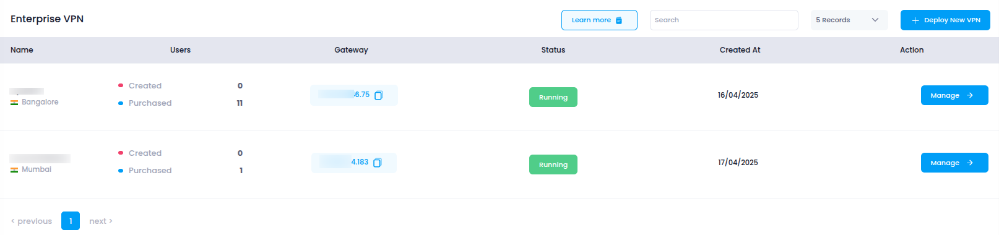

# **Access VPN in Utho Cloud**

This guide will help you access and manage your **VPNs** in Utho Cloud, ensuring secure network connectivity and remote access.

---

## **Step 1: Login or Sign Up to Utho Cloud**

1. Visit the [Utho Cloud Console](https://console.utho.com/login).
2. If you already have an account, enter your credentials and click **Login**.
3. If you're new, click [Signup](https://console.utho.com/signup) and complete the registration process.
4. After logging in, you'll land on the **Utho Cloud Dashboard**.

---

## **Step 2: Navigate to the VPN Section**

You can access the **VPN** page using the following methods:

### **Method 1: Sidebar Navigation**

1. On the dashboard, locate the **sidebar menu** on the left.
2. Scroll down to the **Networking** section.
3. Click on **VPN** to expand the networking options.
4. Select **VPNs** from the expanded list.
5. You’ll be redirected to the **VPN Listing Page**.

### **Method 2: Using the Search Bar**

1. Use the **search bar** at the top of the sidebar.
2. Type **"VPN"**.
3. Click on the **VPN** item from the search results.
4. The sidebar menu will expand showing options under VPN.
5. Click on **VPNs** to open the **VPN Listing Page**.

### **Method 3: Direct URL Access**

If you're already logged in, you can directly access the VPN section:

👉 [Go to VPNs](https://console.utho.com/vpn)

---

## **What You'll See in the VPN Section**

Once inside the **VPN Listing Page**, you'll find a list of all the VPNs created in your account, along with key information such as:

- **VPN Name**: The name assigned to the VPN.
- **Datacenter Location**: The physical location of the data center hosting the VPN.
- **Number of Users**: The total number of users associated with the VPN.
- **VPN Gateway**: The IP address or hostname of the VPN gateway.
- **Status**: Indicates whether the VPN is active or inactive.
- **Manage**: Button to view and modify the VPN’s configuration.

VPNs in Utho Cloud provide secure and encrypted connections to your cloud infrastructure, enabling remote access to private network resources. They are essential for secure communication, protecting sensitive data, and ensuring safe network access for users.
