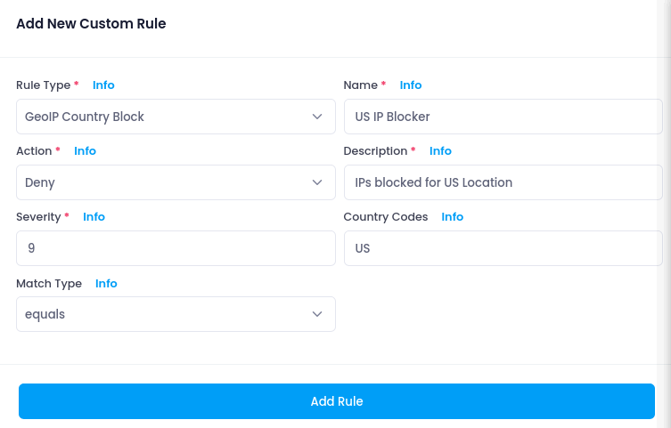

# **Add Rules to Ruleset**

Once you've created a **custom ruleset** in your WAF, the next step is to add individual rules that define how traffic should be filtered, blocked, or logged. These rules offer granular control over specific HTTP behaviors or traffic patterns.

---

## **Access the Ruleset**

1. Go to the **Utho Cloud Console** and navigate to **WAF**.
2. Click **Manage** on the WAF instance.
3. Open the **Custom Rules** tab.
4. Locate your custom ruleset and click **Add Rule**.

---

## **Configuring a New Rule**

The **Add Rule** form presents the following configuration options:

---

### **1. Rule Type**
Choose the behavior the rule should monitor or block. Supported types include:

- `IP Block`
- `GeoIP Country Block`
- `User-Agent Block`
- `HTTP Method Block`
- `URI Pattern Block`
- `Header Match`
- `Rate Limit`
- `Custom Rule`

Each type unlocks additional fields relevant to its function. For example:
- `IP Block` asks for an IP/CIDR and access behavior (allow, deny, log).
- `URI Pattern Block` allows specifying a regex or keyword.
- `Rate Limit` needs rate thresholds like `10:60`.

---

### **2. Name**

A descriptive name that helps identify the rule’s intent.  
**Examples**: `block-cn`, `deny-sqlmap-ua`, `rate-limit-login`.

---

### **3. Action**

Defines what to do when the rule matches:

- `Allow`: Let the request through.
- `Deny`: Block with a response.
- `Drop`: Silently discard the request.
- `Log`: Only log the request.
- `Pass`: Skip evaluation of this rule.

---

### **4. Description**

Explain the rule's purpose for better team visibility and future maintenance.

---

### **5. Severity**

A number from `0` to `9` representing the criticality of the rule.  
**Higher numbers (8–9)** for serious threats like RCE or SQLi.

---

## **Additional Input Fields by Rule Type**

Depending on the selected **Rule Type**, the form dynamically shows relevant inputs:

| Rule Type               | Additional Fields Required                         |
|-------------------------|-----------------------------------------------------|
| IP Block                | IP/CIDR, Match Type (allow, deny, log)             |
| GeoIP Country Block     | Country Code (e.g., `CN`, `RU`)                    |
| User-Agent Block        | User-Agent string (e.g., `sqlmap`, `curl`)         |
| HTTP Method Block       | Method (e.g., `DELETE`)                            |
| URI Pattern Block       | URI value and Match Type (`contains` / `regex`)    |
| Header Match            | Header Name & Header Value                         |
| Rate Limit              | Rate (e.g., `10:60` means 10 reqs in 60 seconds)   |
| Custom Rule             | Custom expression in rule syntax                   |

---

## **Example Use Cases**

| Name               | Rule Type           | Action | Description                                      |
|--------------------|---------------------|--------|--------------------------------------------------|
| `block-china`      | GeoIP Country Block | Deny   | Block all requests originating from China        |
| `deny-sqlmap`      | User-Agent Block    | Deny   | Prevent automated tools like sqlmap              |
| `rate-limit-login` | Rate Limit          | Drop   | Protect login endpoint from brute-force attacks  |
| `block-referer`    | Header Match        | Deny   | Block requests with `Referer: evil.com`          |

---

## **Saving the Rule**

Once all fields are filled:

1. Click **Add Rule**.
2. The rule will appear under the selected ruleset and will immediately begin evaluating traffic.
3. You can enable/disable these rules at any time.

> ✅ Tip: Use a mix of broad rules (like GeoIP) and specific rules (like Header Match) to create layered security logic.

---

## **What’s Next?**

You’ve now added custom security logic to your ruleset. You can continue adding more rules as needed or:

- Review existing [Managed Ruleset Configurations](https://docs.utho.com/products/security/WAF/How%20Tos/Configure%20Managed%20Rules)
- View real-time [Logs & Alerts](https://console.utho.com/waf/logs)
- Attach WAF to [Load Balancers](https://docs.utho.com/products/security/WAF/How%20Tos/Attach%20LoadBalancer)

