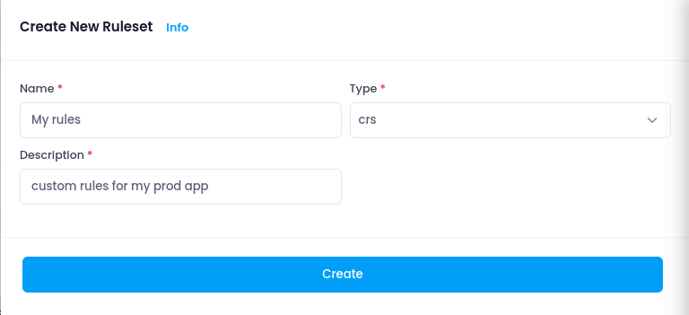

# **Create Custom Ruleset in WAF**

The Utho Web Application Firewall (WAF) allows you to go beyond predefined protections by creating **Custom Rulesets**. These rulesets serve as containers for your own custom security rules that target specific behaviors, threats, or patterns relevant to your applications.

This guide walks you through creating a custom ruleset — a prerequisite step before defining individual custom rules.

---

## **Access WAF**

1. Log in to the [Utho Cloud Platform Console](https://console.utho.com).
2. Navigate to the **WAF** section from the sidebar.
3. Click **Manage** on the WAF where you want to add a ruleset.
4. Switch to the **Custom Rules** tab.

---

## **Steps to Create a Custom Ruleset**

Click on **Attach New Ruleset** to open the creation form.

### 1. **Name**

- **Purpose**: This is the unique identifier for your ruleset.
- **Best Practices**: Use descriptive names like `api-rules`, `login-firewall`, or `ecommerce-filters`.
- **Note**: The name helps you manage and locate the ruleset easily across environments.

### 2. **Type**

- **Options**: `custom` or `crs`
- **Custom**: Choose this when defining your own set of rules from scratch.
- **CRS** (Core Rule Set): Reserved for rulesets based on prebuilt common rule logic. For manual rules, always select **custom**.

### 3. **Description**

- **Purpose**: Use this to describe the purpose of the ruleset, what kind of rules it contains, or the area of the app it protects.
- **Examples**:
  - "Protects login endpoints from brute-force attempts."
  - "Applies stricter headers and URI rules for admin panel."
  - "Filters known bad IPs and User-Agents from blog traffic."

---

## **After Creating a Ruleset**

Once the custom ruleset is created:

- It will appear in your **Custom Rules** list under the WAF instance.
- You can now begin **adding custom rules** into this ruleset using the **Add Rule** button.
- Each ruleset can contain multiple rules, each with its own logic, type, and enforcement behavior.

> ⚠️ Remember: Creating a ruleset does not enforce any protection by itself. You must populate it with specific rules for it to become effective.

