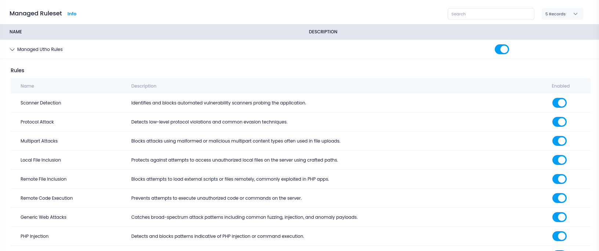

# **Configure Managed Rules in WAF**

Once you have deployed a WAF, it comes equipped with a pre-configured **Managed Ruleset** that provides immediate protection against a wide range of common threats. You can enable or disable this entire ruleset, or fine-tune it by toggling specific rules depending on your application's needs.

---

## **Accessing Managed Rules**

1. Go to the **WAF** section from the Utho dashboard.
2. Click on the **Manage** button of the WAF instance you want to configure.
3. Navigate to the **Managed Ruleset** section.

---

## **How Managed Rules Work**

The **Managed Ruleset** includes battle-tested rules that detect and block known attack patterns such as:

- SQL Injection  
- Cross-Site Scripting (XSS)  
- Remote Code Execution  
- File Inclusion Attacks  
- Web Shells  
- Protocol Exploits  
- Data Leakage Detection  
- Session Fixation  
- HTTP Method Abuse  
- Bot/Scanner Identification  
...and more.

These rules are curated by security experts and cover both generic and specific threat vectors across various web technologies (e.g., PHP, Java, IIS).

---

## **Enable/Disable Entire Ruleset**

You can **toggle the full ruleset ON or OFF** using the main switch:

- **Enabled**: All included rules are enforced to inspect incoming traffic. Best for production setups.
- **Disabled**: Turns off all rules in the set. Useful for debugging or when you're applying a fully custom set of rules.

> ⚠️ Disabling the entire ruleset exposes your applications to common web threats. Do this only if you have a custom rule strategy in place.

---

## **Enable/Disable Individual Rules**

Each rule in the ruleset is listed with its name and description. You can toggle individual rules on or off based on your needs.

Here are some examples of rules included:

| Rule Name               | Purpose                                                                 |
|-------------------------|-------------------------------------------------------------------------|
| **Scanner Detection**   | Blocks known automated vulnerability scanners probing your application. |
| **SQL Injection**       | Detects and blocks malicious SQL payloads in request parameters.        |
| **XSS Protection**      | Blocks attempts to inject malicious JavaScript into web pages.          |
| **Remote File Inclusion** | Prevents loading of external files/scripts from attacker domains.     |
| **Web Shell Detection** | Identifies attempts to upload or access backdoor web shells.            |
| **PHP/Java Data Leakages** | Prevents stack traces or error messages from leaking internal info. |

> 🔍 Each rule can be toggled **independently**, allowing you to disable any rule that may be triggering false positives or enable only those you need based on your risk appetite.

---

## **Best Practices for Managed Rules**

- Start with **all rules enabled** for maximum protection.
- **Monitor logs** for false positives (e.g., legitimate requests being blocked).
- **Disable selectively** if a rule conflicts with a specific app behavior.
- Combine managed rules with **custom rules** for tailored protection.
