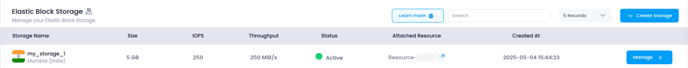

# **Access Elastic Block Storage in Utho Cloud**

This guide will show you how to access and manage your **Elastic Block Storage (EBS)** volumes in Utho Cloud, enabling you to configure, resize, attach, and detach volumes for your cloud infrastructure.

---

## **Step 1: Login or Sign Up to Utho Cloud**

1. Visit the [Utho Cloud Console](https://console.utho.com/login).
2. If you already have an account, enter your credentials and click **Login**.
3. If you're new, click [Signup](https://console.utho.com/signup) and complete the registration process.
4. After logging in, you'll land on the **Utho Cloud Dashboard**.

---

## **Step 2: Navigate to Elastic Block Storage**

You can access **Elastic Block Storage (EBS)** in the following ways:

### **Method 1: Sidebar Navigation**

1. On the dashboard, locate the **sidebar menu** on the left.
2. Scroll down to the **Storage** section.
3. Click on **Elastic Block Storage** to expand the storage options.
4. Select **Elastic Block Storage** from the expanded list.
5. You’ll be redirected to the **Elastic Block Storage Listing Page**.

### **Method 2: Using the Search Bar**

1. Use the **search bar** at the top of the sidebar.
2. Type **"Elastic Block Storage"**.
3. Click on the **Elastic Block Storage** item from the search results.
4. The sidebar menu will expand showing options under Elastic Block Storage.
5. Click on **Elastic Block Storage** to open the **EBS Listing Page**.

### **Method 3: Direct URL Access**

If you're already logged in, you can directly access the Elastic Block Storage section:

👉 [Go to Elastic Block Storage](https://console.utho.com/ebs)

---

## **What You'll See in the Elastic Block Storage Section**

Once inside the **Elastic Block Storage Listing Page**, you'll find a list of all your created **EBS volumes**, along with key information such as:

- **Storage Name**: The name of the Elastic Block Storage.
- **Size**: The total allocated storage capacity.
- **IOPS**: The Input/Output Operations per Second (IOPS) for your volume.
- **Throughput**: The throughput settings for the volume.
- **Status**: Indicates whether the volume is active or inactive.
- **Manage**: Button to view and modify the volume’s configuration.

