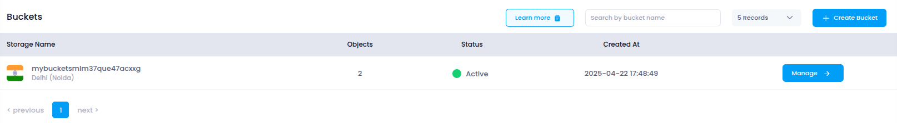

# **Access Object Storage in Utho Cloud**

This guide will walk you through the process of accessing and managing your **Object Storage** in Utho Cloud for efficient data storage and management.

---

## **Step 1: Login or Sign Up to Utho Cloud**

1. Visit the [Utho Cloud Console](https://console.utho.com/login).
2. If you already have an account, enter your credentials and click **Login**.
3. If you're new, click [Signup](https://console.utho.com/signup) and complete the registration process.
4. After logging in, you'll land on the **Utho Cloud Dashboard**.

---

## **Step 2: Navigate to Object Storage**

You can access **Object Storage** in the following ways:

### **Method 1: Sidebar Navigation**

1. On the dashboard, locate the **sidebar menu** on the left.
2. Scroll down to the **Storage** section.
3. Click on **Object Storage** to expand the storage options.
4. Select **Object Storage** from the expanded list.
5. You’ll be redirected to the **Object Storage Listing Page**.

### **Method 2: Using the Search Bar**

1. Use the **search bar** at the top of the sidebar.
2. Type **"Object Storage"**.
3. Click on the **Object Storage** item from the search results.
4. The sidebar menu will expand showing options under Object Storage.
5. Click on **Buckets** to open the **Object Storage Listing Page**.

### **Method 3: Direct URL Access**

If you're already logged in, you can directly access the Object Storage section:

👉 [Go to Object Storage](https://console.utho.com/objectstorage/buckets)

---

## **What You'll See in the Object Storage Section**

Once inside the **Object Storage Listing Page**, you will find a list of all your created **object storage buckets**, along with key information such as:

- **Bucket Name**: The name of the object storage bucket.
- **Datacenter Location**: The physical or geographical region where the bucket is stored.
- **Objects**: The number of objects in your storage.
- **Status**: Indicates whether the bucket is active or inactive.
- **Manage**: Button to view and modify the bucket’s configuration.

Object Storage in Utho Cloud is designed to store and manage vast amounts of unstructured data such as images, videos, backups, logs, and more. It provides a scalable, durable, and secure storage solution to meet your needs.
