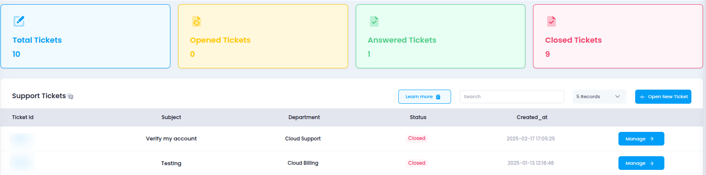

# **Access Tickets in Utho Cloud**

This guide will help you access and manage your **Tickets** in Utho Cloud for efficient issue resolution related to support, billing, or sales.

---

## **Step 1: Login to Utho Cloud Platform**

1. Visit the [Utho Cloud Console](https://console.utho.com/login).
2. Enter your credentials and click **Login**.
3. Once logged in, you’ll be directed to the **Utho Cloud Dashboard**.

---

## **Step 2: Navigate to the Tickets Section**

You can access the **Tickets** page through the following methods:

### **Method 1: Sidebar Navigation**

1. On the dashboard, locate the **sidebar menu** on the left.
2. Scroll down to the **Support** section.
3. Click on **Tickets**.
4. You’ll be redirected to the **Ticket Listing Page**.

### **Method 2: Using the Search Bar**

1. Use the **search bar** at the top of the sidebar.
2. Type **"Tickets"**.
3. Click on **Tickets** from the search results.
4. This will take you to the **Ticket Listing Page**.

### **Method 3: Direct URL Access**

If you're already logged in, you can directly access the Tickets section:

👉 [Go to Tickets](https://console.utho.com/ticket)

---

## **What You'll See in the Tickets Section**

Once inside the **Ticket Listing Page**, you'll find a list of all the tickets raised in your account, along with key details such as:

- **Ticket ID**: Unique identifier for the ticket.
- **Subject**: The subject or title of the ticket.
- **Department**: The department the ticket is directed to (Support, Billing, or Sales).
- **Status**: Current status of the ticket (Open, Answered, or Closed).
- **Priority**: Urgency of the issue (Medium, Urgent, or Low).
- **Creation Date**: Date and time when the ticket was created.
- **Actions**: Options to reply, close, or manage the ticket.

Tickets in Utho Cloud allow you to efficiently track and resolve issues related to your account, cloud services, or billing concerns. 

